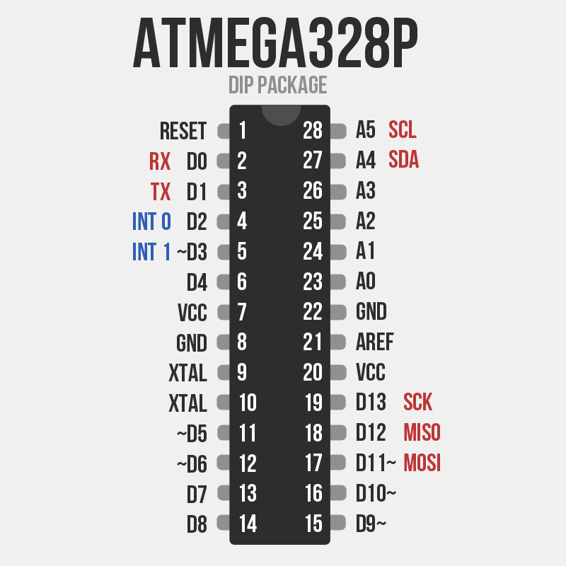
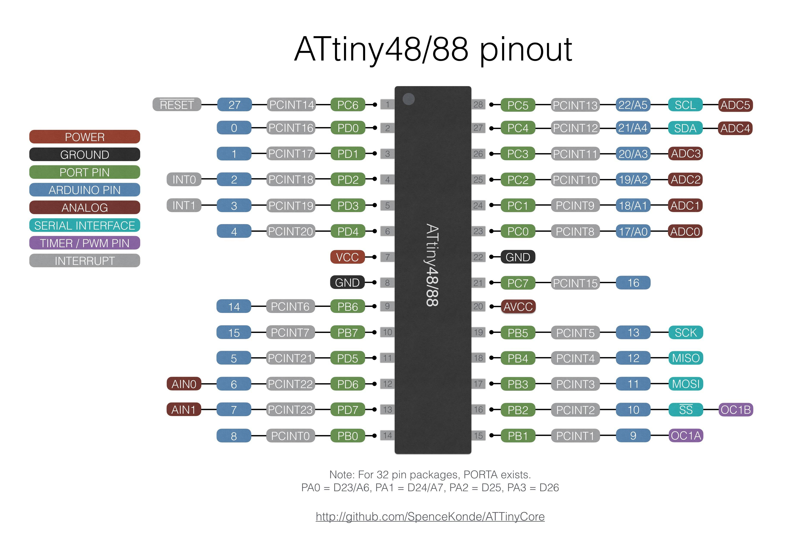
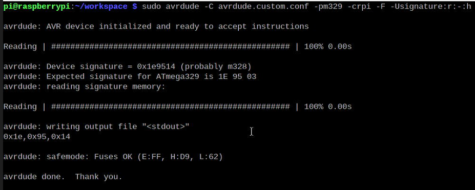

# Reading AVR Micro Controller Device Signatures using [`avrdude`](https://github.com/avrdudes/avrdude/blob/main/README.md) Command Line Program

<br>


<br>

***Device signature*** is a unique **3-byte** signature which helps to identify
different Micro Controllers by their types as specified in the [avrdude
configuration file](https://github.com/avrdudes/avrdude/blob/main/src/avrdude.conf.in).\
Device signature of AVR Micro Controller can be very useful for many developers
and engineers.These device signatures can be read from devices with the help of
`avrdude` command line program.

> AVRDUDE - AVR Downloader Uploader - is a program for downloading and uploading
the on-chip memories of Microchip’s
[AVR microcontrollers](https://en.wikipedia.org/wiki/AVR_microcontrollers).
It can program the Flash and EEPROM, and where supported by the programming
protocol, it can program fuse and lock bits. AVRDUDE also supplies a direct
instruction mode allowing one to issue any programming instruction to the AVR
chip regardless of whether AVRDUDE implements that specific feature of a
particular chip.
<br><br>
AVRDUDE was originally written in 2003 by Brian S. Dean. Since 2006, AVRDUDE has
been maintained by Jörg Wunsch, with the help of
[various contributors](https://github.com/avrdudes/avrdude/blob/main/AUTHORS).
<br><br>
The latest version of AVRDUDE is always available here:\
<https://github.com/avrdudes/avrdude>

## Reading Signatures

For reading signature from device we need to connect a programmer with the Micro
Controller and specify the programmer in the `avrdude` configuration file. I
shall be using Raspberry Pi board as programmer and reading signatures
through SPI communication.

### **Hardware Setup**

We need 6 jumper wires to connect AVR Micro Controller with the GPIO pins of Raspberry
Pi. Following table can be used for the reference of finding physical SPI pins
in two types of chips viz. ATmega328p/ATmega328 and ATtiny88.

| Name of Micro Controller | VCC | GND | MOSI | MISO | SCK | RESET |
|--------------------------|:---:|:---:|:----:|:----:|:---:|:-----:|
| ATmega328p/ATmega328     | 7   | 8   | 17   | 18   | 19  | 1     |
| ATtiny88                 | 7   | 8   | 17   | 18   | 19  | 1     |

<br>

**ATmega328p PinOut**\


<br>

**ATtiny88 PinOut**\


<br>

Now this MOSI, MISO, SCK, RESET, VCC and Ground pins need to connected with the
GPIO of Raspberry Pi. Following table can be used for the reference of finding
SPI0 pins of Raspberry Pi.

_[Raspberry Pi SPI Pins](https://pinout.xyz/pinout/spi#) -_

| VCC        | GND        | SPI0 MOSI             | SPI0 MISO            | SPI0 SCLK             | SPI0 RESET           |
|:----------:|:----------:|:---------------------:|:--------------------:|:---------------------:|:--------------------:|
| Physical 2 | Physical 4 | GPIO 10 (Physical 19) | GPIO 9 (Physical 21) | GPIO 11 (Physical 23) | GPIO 8 (Physical 24) |

### **Software Setup**

First all we need to install `avrdude` package in the Raspberry Pi. Following
command in terminal can install `avrdude`.

```sh
sudo apt install avrdude
```
Now to keep environment clutter free we can make a workspace directory and copy
and save required files. Also we need to copy `avrdude.conf` from `/etc`
directory into our workspace.

```sh
mkdir workspace && cd workspace
cp /etc/avrdude.conf ./avrdude.custom.conf
```
Then we need to add a new programmer in `avrdude.custom.conf`. So we can open it
in any text editor and add below lines at the end of file and save it.

```
programmer
  id = "rpi";
  desc = "Program with Raspberry Pi GPIO";
  type = "linuxgpio";
  connection_type = serial;
  mosi = 10;
  miso = 9;
  sck = 11;
  reset = 8;
;
```

### **Run Command to read the signature**

Following is the avrdude command syntax to read the signature of the connected
device.
```sh
sudo avrdude -C avrdude.custom.conf -p <any_part_number> -c <custom_programmer> -U signature:r:<file_name>:<format>
```

- Here *part_number* could be anything e.g. `m328`, `m329` etc. Avrdude Configuration
file can used for the reference of more part numbers or [Avrdude Docs](https://avrdudes.github.io/avrdude/current/avrdude_3.html#Option-Descriptions) are very useful
too.
- Since we are programming using Raspberry Pi so the *custom_programmer* should the custom
id of the programmer which added in the software setup section. So it should be `rpi`.
- *file_name* could be any filename where read signature will be stored or we may
use "`-`" for writing the output in the standard output.
- Format is the output format of the avrdude command or more specifically the
format of signature. Possible values of *format* are: `i, s, r, e, m, a, d, h, o, b`
	- `i` : intel hex format
	- `d` : decimal
	- `h` : hexadecimal
	- `o` : octal
	- `b` : binary\
More details and other option descriptions can be found at [Avrdude Docs](https://avrdudes.github.io/avrdude/current/avrdude_3.html#Option-Descriptions)

#### Example

After connecting a Micro Controller following the above mentioned procedure I ran
the below command.
```sh
sudo avrdude -C avrdude.custom.conf -p m329 -c rpi -U signature:r:-:h
```
And the output shown in the terminal is -



So it is showing that the device connected is a **ATmega328 Chip** and its
signature is `0x19,0x95,0x14`.

## Next Step

We can further program AVR Micro Controller using avrdude from command line and
a text editor (without Arduino IDE). For that refer to this experiment blog -
<http://arghyabiswas.com/program-avr-type-microcontroller-by-raspberry-pi-gpio>.
In that blog programming a AVR Micro Controller using Raspberry Pi GPIO can be
further studied.

## Reference

1. Avrdude Documentation: <https://avrdudes.github.io/avrdude>
2. Avrdude Github: <https://github.com/avrdudes/avrdude>
3. ATmega328p PinOut: <https://microcontrollerslab.com/atmega328p-microcontroller-pinout-prograamming-features-datasheet/>
4. ATtiny88 PinOut: <https://microcontrollerslab.com/attiny88-microcontroller-pinout-programming-datasheet-features-applications/>
5. Raspberry Pi SPI PinOut: <https://pinout.xyz/pinout/spi#>
6. Program AVR Type Microcontroller by Raspberry Pi GPIO blog: <http://arghyabiswas.com/program-avr-type-microcontroller-by-raspberry-pi-gpio>

## Credit

I am grateful to [Mr. Arghya Biswas, Currently Boot Firmware Engineer at Intel Technology India Pvt. Ltd.](http://arghyabiswas.com/) for inspiring and this opportunity.\
Also I would like to extend my gratitude to all the team member of [iAloy](https://ialoy.com).